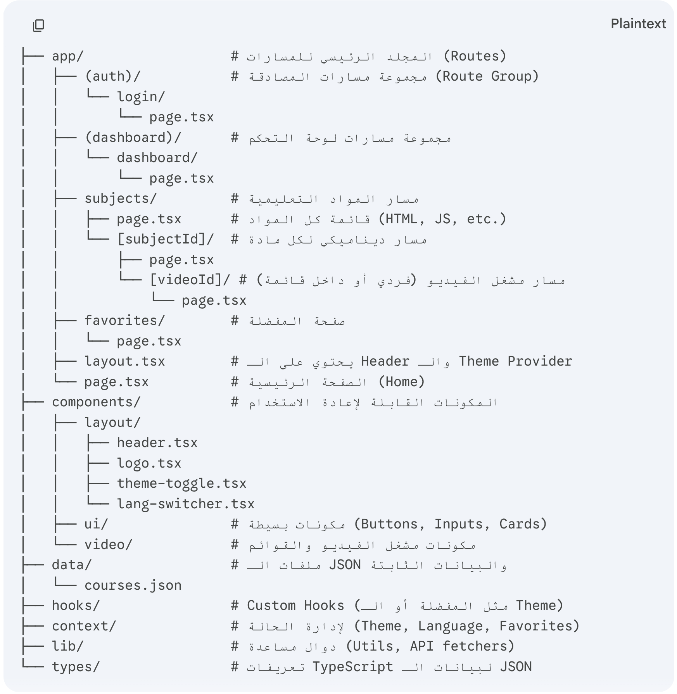

# 📚 Educational Platform - Project Roadmap

## 📂 Project Structure
Below is the visual structure of the project folders:



```text
├── app/                  # Routes & Pages (Next.js App Router)
│   ├── (auth)/           # Login & Authentication
│   ├── (dashboard)/      # User progress & Statistics
│   ├── subjects/         # All subjects listing
│   │   └── [subjectId]/  # Lessons list & Video player (Dynamic)
│   ├── favorites/        # Saved videos page
│   ├── layout.tsx        # Main Layout (Header, Footer, Providers)
│   └── page.tsx          # Home Page
├── components/           # Reusable UI Components
│   ├── layout/           # Header, Logo, Navigation elements
│   ├── ui/               # Base components (Shadcn UI / Tailwind)
│   └── video/            # Video player & Sidebar components
├── context/              # State Management (Favorites, Theme, Language)
├── data/                 # courses.json (Database)
├── hooks/                # Custom React hooks
├── lib/                  # Utility functions & API helpers
├── public/               # Static assets (Images, Icons)
│   └── images/           # Screenshots & Graphics
├── types/                # TypeScript Interfaces & Types
└── ROADMAP.md            # Project Tracking


# ✅ To Do List

## 🧱 Phase 1: Foundation & Setup

* [x] Initialize Next.js project (App Router, Tailwind CSS, TypeScript)
* [x] Setup folder structure
* [ ] Define TypeScript interfaces in `/types/index.ts`
* [ ] Prepare initial data in `/data/courses.json` (HTML & CSS sample)
* [ ] Configure theme system (dark/light mode using next-themes)

---

## 🎨 Phase 2: Global UI & Identity

### Header

* [ ] Build navigation header
* [ ] Add dynamic logo
* [ ] Implement AR/EN language switcher
* [ ] Add theme toggle
* [ ] Display favorites counter/badge
* [ ] Add login button

### Footer

* [ ] Build footer component

---

## 📺 Phase 3: Core Features (Educational Content)

### Pages

* [ ] Home page (hero section + subject previews)
* [ ] Subjects grid (HTML, JavaScript, React, Next.js)

### Learning Page

* [ ] Dynamic routing for subjects/courses
* [ ] Language switch logic (AR/EN)
* [ ] Tabs: Lessons / Projects
* [ ] FAQs section
* [ ] Tools & Resources section

### Video System

* [ ] Video player integration
* [ ] Support single videos & playlists
* [ ] Integrate YouTube Iframe API (progress tracking)

---

## 🧠 Phase 4: Logic & State Management

* [ ] Implement Favorites Context
* [ ] Save data in localStorage (favorites + progress)
* [ ] Filter content by language & subject

---

## 👤 Phase 5: Dashboard & Authentication

* [ ] Design static login page
* [ ] Build user dashboard:

  * [ ] Recently watched
  * [ ] Saved items

---

## ✨ Phase 6: Polish & Deployment

* [ ] Add animations (Framer Motion)
* [ ] Ensure mobile responsiveness (especially video player)
* [ ] Add SEO metadata per subject/page
* [ ] Deploy project to Vercel

---

## 📌 Future Improvements

* [ ] Backend integration (auth + database)
* [ ] User progress tracking system
* [ ] Comments / community features
* [ ] Admin dashboard for content management
